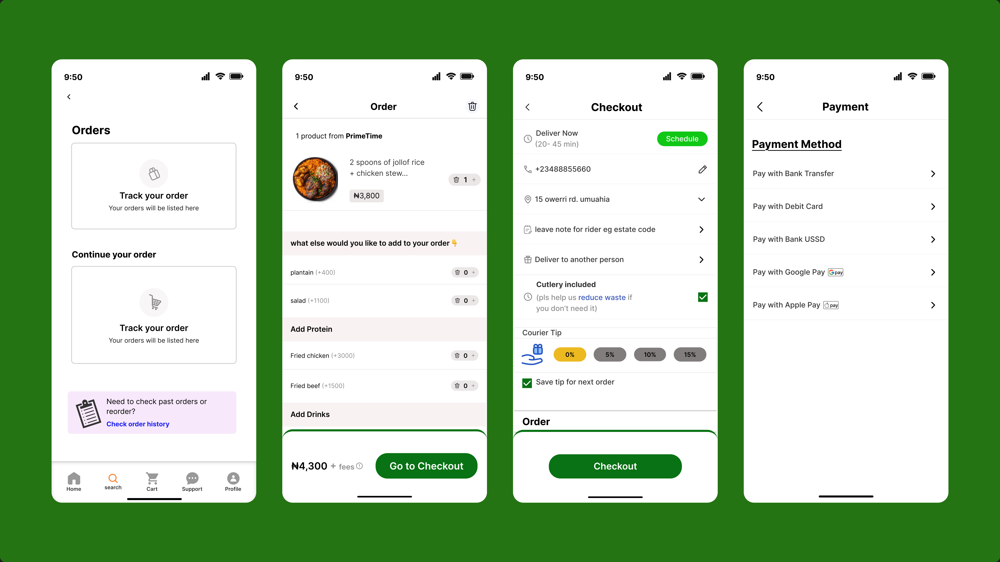
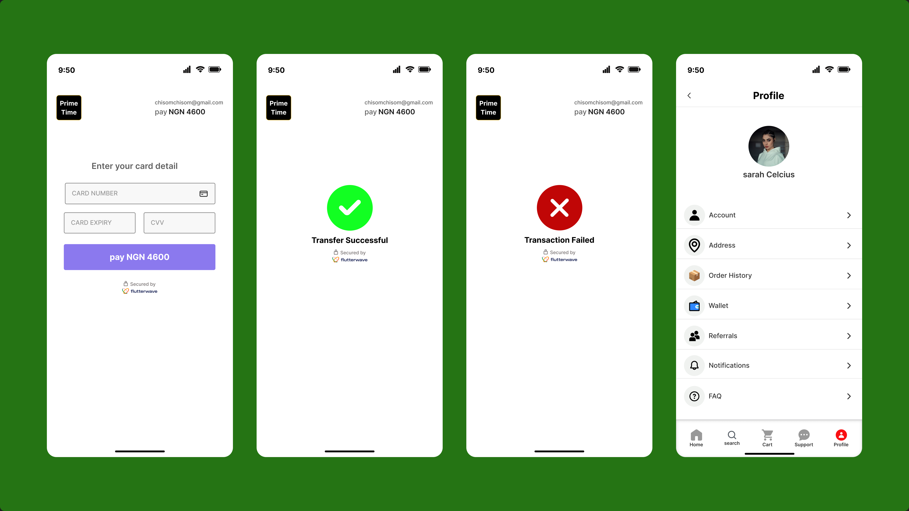

# Food-Delivery-App-UI

Modern food delivery mobile app exploration focused on clean layouts, smooth ordering flow and intuitive user experience. Designed in Figma.

## Features
- Clean mobile interface
- Food browsing experience
- Restaurant details
- Cart & checkout flow

## Tools
- Figma

 

## Preview

  

  

# Create account & Login

  

# Search

 

# checkout

 

# Payment

  

  

  

